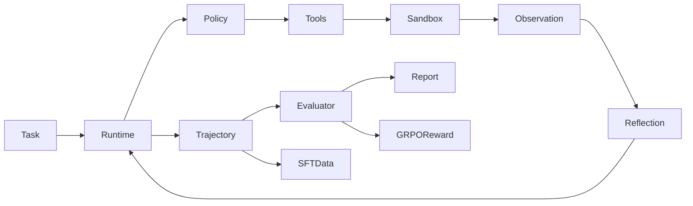

# MiniMind-AgentLab

**Trainable and Evaluatable Code Agent based on MiniMind**

MiniMind-AgentLab 是在原 MiniMind 仓库中新增的轻量级单 Code Agent 求职项目。它能在隔离的微型
Python 仓库副本中检索、阅读、精确修改代码、运行白名单测试并记录多轮轨迹，同时提供自动评测、
MiniMind LoRA-SFT 数据构造、最小 GRPO 实验、FastAPI 和 Streamlit 页面。

它复用原项目的 `MiniMindForCausalLM`、Tokenizer Chat Template、`SFTDataset`、LoRA 注入和
rollout 思路，不修改模型结构或 Tokenizer。小模型适合这个实验，因为工具协议、有限上下文和可验证
任务能把问题约束在可测范围内，并允许低成本研究轨迹质量、错误类型、SFT 与 RL reward。

## 架构与 Agent Loop



Loop 为：加载任务 → 复制仓库到临时 Sandbox → 生成稳定计划 → Policy 产出 Tool Call/Final →
工具名、JSON 参数与路径校验 → 执行 → Observation/Reflection → 重复与无进展检测 → 达到最终
回答、超时或最大步数 → 保存轨迹 → 由测试和变更范围评测。

主要模块：

- `agentlab/schemas.py`：Task、State、Action、ToolCall、ToolResult、Trajectory、EvaluationResult。
- `runtime.py`：与模型无关的 Agent Loop、限制、异常和最终状态。
- `planner.py`、`reflection.py`、`context_manager.py`：稳定计划、规则反思和上下文压缩。
- `policies/`：确定性 Scripted、Transformers MiniMind、OpenAI-compatible 三种策略。
- `env/`、`tools/`：Sandbox、参数校验及六个仓库工具。
- `evaluation/`：Benchmark 加载、成功判定、错误分类、聚合指标和 JSON/Markdown 报告。
- `trajectory.py`：写入逐步摘要、原始工具输出、diff、测试输出和 summary。
- `service/`：FastAPI 与 SQLite run 元数据；轨迹仍为 JSON 文件。

更完整的职责边界见 [docs/agentlab_architecture.md](docs/agentlab_architecture.md)。

## 工具和安全

只提供 `list_files`、`search_code`、`read_file`、`apply_patch`、`run_tests`、`git_diff`。
`apply_patch` 要求 `old_text` 唯一存在；`run_tests` 只把以下三个精确字符串映射为 `shell=False`
参数数组：

```text
pytest -q
python -m pytest -q
python -m compileall .
```

每个任务使用临时副本。绝对路径、`..`、越界符号链接、二进制 Patch 和未知参数会被拒绝；
原 Benchmark 不被修改。工具输出有长度限制，完整输出单独保存在 run 目录。该 Sandbox 是面向
可信微型 Benchmark 的进程级隔离，不是容器或恶意代码安全边界。

## Benchmark

`benchmarks/agentlab` 包含 `calculator_app`、`text_utils`、`task_manager` 三个基础测试通过的仓库，
以及 20 个任务（train 12、dev 3、test 5）。修改任务在临时副本中注入任务测试。

```json
{
  "task_id": "calculator_fix_divide_zero",
  "repo_id": "calculator_app",
  "task_type": "bug_fix",
  "prompt": "Make divide() raise ValueError when the divisor is zero.",
  "validator": {
    "type": "pytest",
    "command": "pytest -q",
    "test_file": "validators/calculator_fix_divide_zero.py"
  },
  "gold": {"modified_files": ["src/calculator/core.py"]},
  "split": "train"
}
```

## Trajectory 与评测

每次运行生成：

```text
runs/{run_id}/trajectory.json
runs/{run_id}/tool_outputs/*.txt
runs/{run_id}/final_diff.patch
runs/{run_id}/test_output.txt
runs/{run_id}/summary.json
```

轨迹记录计划、动作、参数、结果摘要/引用、延迟、Reflection、最终回答、变更文件、测试结果和错误
类型。指标由实际任务结果聚合：`task_success_rate`、`test_pass_rate`、`valid_tool_call_rate`、
`invalid_tool_call_rate`、`argument_validity_rate`、`repeated_call_rate`、`average_steps`、
`average_latency`、`timeout_rate`、`patch_validity_rate`。错误分类覆盖规划、工具、参数、路径、
搜索、重复、Patch、测试、超时、最大步数、早停、虚假成功、模型和未知错误。

## 安装与模型

推荐 Python 3.10+ 的独立虚拟环境：

```bash
pip install -r requirements.txt
pip install -r requirements_agentlab.txt
git clone https://huggingface.co/jingyaogong/minimind-3
```

Transformers 格式目录通过 `AutoTokenizer`、`AutoModelForCausalLM` 加载。Policy 用
`tokenizer.apply_chat_template(..., tools=..., open_thinking=...)`，并解析 MiniMind 原生
`<tool_call>{"name":...,"arguments":...}</tool_call>`。

## 可复现命令

在仓库根目录执行：

```bash
# 1. 测试
pytest -q tests/agentlab

# 2. 无模型完整链路
python scripts/agentlab_smoke.py

# 3. Scripted test split 评测
python scripts/agentlab_eval.py --split test --policy scripted

# 4. 单任务
python scripts/agentlab_run.py --task_id calculator_fix_divide_zero --policy scripted

# 5. MiniMind Policy
python scripts/agentlab_run.py \
  --task_id calculator_fix_divide_zero \
  --policy minimind \
  --model_path ./minimind-3

# 6. 构造并检查 SFT 数据
python scripts/agentlab_build_data.py --dry_run --forward --max_seq_len 2048

# 7. LoRA（从 trainer 目录运行；参数与现有 train_lora.py 一致）
cd trainer
python train_lora.py \
  --data_path ../dataset/agentlab_sft_train.jsonl \
  --lora_name agentlab_code \
  --from_weight full_sft \
  --epochs 1 \
  --batch_size 1 \
  --accumulation_steps 8 \
  --max_seq_len 2048
cd ..

# 8. Agentic RL smoke/dry-run
python trainer/train_agentlab_grpo.py --smoke_test

# 9. API
uvicorn agentlab.service.app:app --host 0.0.0.0 --port 8000

# 10. WebUI
streamlit run scripts/agentlab_web_demo.py
```

`agentlab_run.py` 也支持 `--task "...prompt..." --repo path --policy minimind --model_path path`。

## LoRA-SFT 数据链路

`agentlab_build_data.py` 从 20 个人工可检查的 gold/scripted seed 和成功 run 构造 MiniMind
`SFTDataset` 所需的 `{"conversations": [...]}` JSONL。system 消息携带序列化工具 Schema；
assistant 的 `tool_calls` 为合法 JSON；失败或不完整轨迹被过滤。原 `SFTDataset` 的 assistant
段标签逻辑继续负责 loss mask。

本次实际生成 `dataset/agentlab_sft_train.jsonl` 20 条、validation 2 条；成功 run 按 task 去重，
没有 run 的任务使用 gold/scripted seed。由于当前验证解释器未安装原仓库基础依赖
`transformers/torch`，Chat Template、loss mask 和单 Batch forward 在本次运行中被明确跳过，
没有声称训练完成。安装 `requirements.txt` 后同一 `--dry_run --forward` 命令会继续执行这些检查。

## GRPO

`trainer/train_agentlab_grpo.py` 定义 group-relative advantage、clipped ratio、KL 和统一到
`[-3, 3]` 的 Code Agent reward 输入。reward 来自真实测试、Patch、工具/参数有效性、重复、超时和
路径违规，而不是最终文本关键词。

本次 `--smoke_test` 实际跑了两个 Scripted 环境 rollout，reward 范围为 `2.750–3.000`，
group advantage 为 `[1,-1,1,-1]`。当前解释器没有 PyTorch，因此 optimizer/KL 张量 step 和 GPU
模型训练未运行；脚本已明确输出该事实。

## FastAPI 与 WebUI

API：

```text
GET  /health
POST /v1/agent/runs
GET  /v1/agent/runs/{run_id}
GET  /v1/agent/runs/{run_id}/trace
GET  /v1/tasks
POST /v1/evaluations
```

SQLite 只保存 run 索引。WebUI 展示任务/仓库/Policy/模型/最大步数、Plan、Tool Trace、
Observation、Reflection、回答、diff、测试和分数，不是普通聊天框。

本次实际验证 FastAPI `/health` 返回 200、`/v1/tasks` 返回 20 项；Streamlit
`/_stcore/health` 返回 `ok`。

## 本次实测

在 Windows、Python 3.12 环境：

```text
pytest -q tests/agentlab
17 passed in 4.07s

python scripts/agentlab_smoke.py
steps=6, tests_passed=True, success=True

python scripts/agentlab_eval.py --split test --policy scripted
5/5 tasks succeeded
```

受限执行沙箱内曾因 user-site 读取限制跳过 FastAPI import；随后使用工作区 basetemp 在沙箱外
重跑全部 17 个用例通过。无法创建真实符号链接的 Windows 环境会用 canonical path 模拟覆盖同一
越界拒绝分支。FastAPI 也已用 TestClient 单独验证。报告实际生成在
`reports/agentlab_eval_20260726_131540.{json,md}`。

## 当前限制与扩展

- 面向小型可信 Python 仓库；不是 OS 容器，不能安全执行恶意测试。
- 精确文本替换比通用 unified diff 稳定，但不适合大规模重构。
- Runtime 总超时在同步模型生成期间不能强制中断底层 GPU kernel。
- ScriptedPolicy 只覆盖可复现 Benchmark；真实 MiniMind 效果取决于模型权重。
- 本次未安装/运行 MiniMind 模型权重、LoRA 训练或 GPU GRPO，未报告任何性能提升。

后续可增加 Linux seccomp/容器隔离、异步取消、更多仓库和任务、真实 MiniMind 基线、轨迹筛选、
curriculum 以及独立 held-out validator，但不需要引入大型 Agent 框架。

## 来源、License 与简历描述

本项目基于 [jingyaogong/minimind](https://github.com/jingyaogong/minimind)，沿用仓库中的
Apache License 2.0；原作者、源码和 License 均保留。

简历描述模板（应按自己实际运行结果更新）：

> 基于 MiniMind 实现轻量级可训练 Code Agent：用原生 Python 构建隔离 Sandbox、6 类代码工具、
> 多轮 Planning/Reflection/Context 管理和完整 Trajectory；设计 3 个微型仓库、20 个可验证任务及
> 自动错误分类/评测，打通 Scripted/MiniMind/OpenAI-compatible Policy、LoRA-SFT 数据构造、
> GRPO reward dry-run、FastAPI 与 Streamlit。CPU 测试与 Scripted test split 结果可由仓库命令复现。
