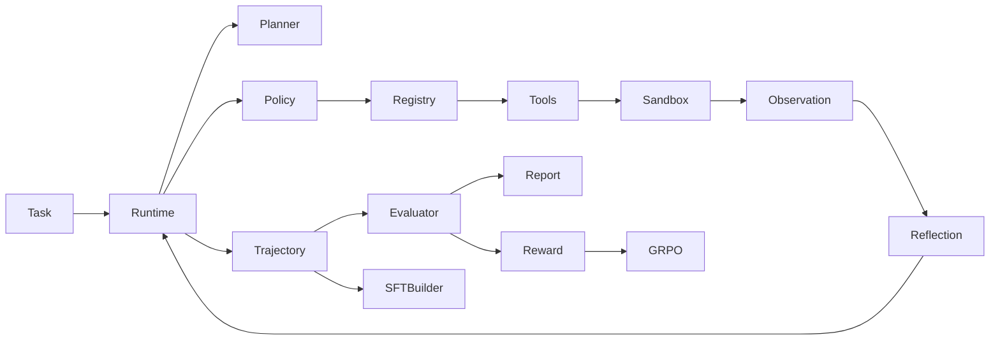

# MiniMind-AgentLab Architecture

MiniMind-AgentLab adds a model-independent code-agent runtime around the existing MiniMind
model, tokenizer, LoRA and rollout code. It does not alter those components.

The trust boundary is the task-level temporary repository copy. Tool paths are relative,
canonicalized and checked against that root. Test execution maps exactly three strings to
argument arrays and never invokes a shell. The original benchmark repository is read-only
from the agent's point of view.

The runtime owns orchestration only. Policies generate structured actions; tools execute
them; the evaluator decides success using tests, expected files and rule-based checks.
Consequently Scripted, MiniMind and OpenAI-compatible policies share the same environment
and metrics.
